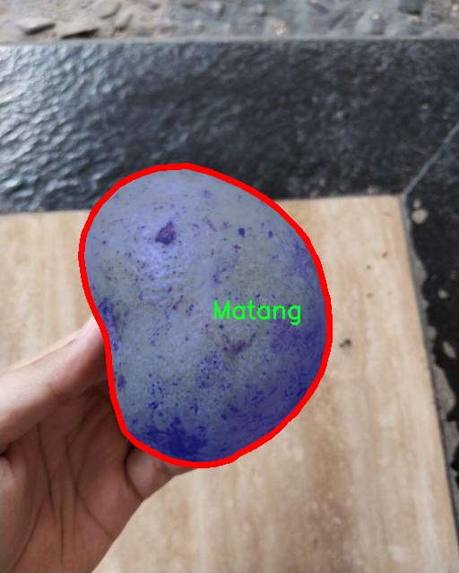

### 1.背景意义

研究背景与意义

随着全球农业科技的迅速发展，智能化的农业生产模式逐渐成为提升农作物产量和质量的重要手段。在众多农作物中，芒果因其独特的风味和丰富的营养价值而备受青睐。然而，芒果的成熟度对其市场价值和消费体验有着直接影响。传统的芒果成熟度检测方法往往依赖于人工观察，不仅效率低下，而且容易受到主观因素的影响。因此，开发一种高效、准确的芒果成熟度检测系统显得尤为重要。

本研究旨在基于改进的YOLOv11模型，构建一个高效的芒果成熟度检测系统。该系统将利用一个包含1600张图像的多类别数据集，涵盖五种不同的成熟度等级：Matang（成熟）、Mengkal（半成熟）、Mentah（未成熟）、Sangat Matang（非常成熟）和Sangat Mentah（非常未成熟）。通过对这些图像的深度学习训练，系统能够实现对芒果成熟度的自动化识别与分类，从而提高检测的准确性和效率。

在数据集的构建过程中，采用了实例分割技术，使得模型不仅能够识别芒果的存在，还能精确定位其边界。这种技术的应用为后续的成熟度评估提供了更加细致的视觉信息。此外，数据集的预处理环节，包括图像的自动方向调整和统一尺寸化处理，为模型训练提供了良好的基础，确保了数据的一致性和可用性。

通过本研究，期望能够为农业生产提供一种智能化的解决方案，帮助农民和商家更好地判断芒果的成熟度，从而优化采摘和销售策略，提高经济效益。同时，该系统的成功实施也为其他农作物的成熟度检测提供了借鉴，推动农业智能化的发展。

### 2.视频效果

[2.1 视频效果](https://www.bilibili.com/video/BV18Rk7YEEQu/)

### 3.图片效果


##### [项目涉及的源码数据来源链接](https://kdocs.cn/l/cszuIiCKVNis)**

注意：本项目提供训练的数据集和训练教程,由于版本持续更新,暂不提供权重文件（best.pt）,请按照6.训练教程进行训练后实现上图演示的效果。

### 4.数据集信息

##### 4.1 本项目数据集类别数＆类别名

nc: 5
names: ['Matang', 'Mengkal', 'Mentah', 'Sangat Matang', 'Sangat Mentah']


该项目为【图像分割】数据集，请在【训练教程和Web端加载模型教程（第三步）】这一步的时候按照【图像分割】部分的教程来训练

##### 4.2 本项目数据集信息介绍

本项目数据集信息介绍

本项目旨在改进YOLOv11模型，以实现高效的芒果成熟度检测系统。为此，我们构建了一个专门针对“芒果成熟度等级”的数据集，该数据集包含五个不同的成熟度类别，分别为“Matang”（成熟）、“Mengkal”（半成熟）、“Mentah”（未成熟）、“Sangat Matang”（非常成熟）和“Sangat Mentah”（非常未成熟）。这些类别涵盖了芒果在生长过程中的各个阶段，能够有效地反映出芒果的成熟度变化。

数据集的构建过程涉及了大量的图像采集与标注工作。我们从多个芒果种植园和市场收集了丰富的图像数据，确保样本的多样性和代表性。每个类别的图像数量经过精心设计，以保证在训练过程中模型能够学习到各个成熟度等级的特征。数据集中不仅包含不同品种的芒果，还涵盖了不同的光照条件、背景环境和拍摄角度，从而增强模型的鲁棒性。

在数据标注方面，我们采用了专业的标注工具，确保每张图像的成熟度等级标注准确无误。通过这样的方式，我们希望能够为YOLOv11模型提供一个高质量的训练基础，使其在实际应用中能够准确识别和分类芒果的成熟度。这一数据集的构建不仅为本项目的研究提供了坚实的基础，也为未来相关领域的研究提供了宝贵的参考资料。通过不断优化和扩展数据集，我们期望进一步提升模型的性能，推动芒果品质检测技术的发展。




### 5.全套项目环境部署视频教程（零基础手把手教学）

[5.1 所需软件PyCharm和Anaconda安装教程（第一步）](https://www.bilibili.com/video/BV1BoC1YCEKi/?spm_id_from=333.999.0.0&vd_source=bc9aec86d164b67a7004b996143742dc)


[5.2 安装Python虚拟环境创建和依赖库安装视频教程（第二步）](https://www.bilibili.com/video/BV1ZoC1YCEBw?spm_id_from=333.788.videopod.sections&vd_source=bc9aec86d164b67a7004b996143742dc)

### 6.改进YOLOv11训练教程和Web_UI前端加载模型教程（零基础手把手教学）

[6.1 改进YOLOv11训练教程和Web_UI前端加载模型教程（第三步）](https://www.bilibili.com/video/BV1BoC1YCEhR?spm_id_from=333.788.videopod.sections&vd_source=bc9aec86d164b67a7004b996143742dc)


按照上面的训练视频教程链接加载项目提供的数据集，运行train.py即可开始训练



     Epoch   gpu_mem       box       obj       cls    labels  img_size
     1/200     20.8G   0.01576   0.01955  0.007536        22      1280: 100%|██████████| 849/849 [14:42<00:00,  1.04s/it]
               Class     Images     Labels          P          R     mAP@.5 mAP@.5:.95: 100%|██████████| 213/213 [01:14<00:00,  2.87it/s]
                 all       3395      17314      0.994      0.957      0.0957      0.0843

     Epoch   gpu_mem       box       obj       cls    labels  img_size
     2/200     20.8G   0.01578   0.01923  0.007006        22      1280: 100%|██████████| 849/849 [14:44<00:00,  1.04s/it]
               Class     Images     Labels          P          R     mAP@.5 mAP@.5:.95: 100%|██████████| 213/213 [01:12<00:00,  2.95it/s]
                 all       3395      17314      0.996      0.956      0.0957      0.0845

     Epoch   gpu_mem       box       obj       cls    labels  img_size
     3/200     20.8G   0.01561    0.0191  0.006895        27      1280: 100%|██████████| 849/849 [10:56<00:00,  1.29it/s]
               Class     Images     Labels          P          R     mAP@.5 mAP@.5:.95: 100%|███████   | 187/213 [00:52<00:00,  4.04it/s]
                 all       3395      17314      0.996      0.957      0.0957      0.0845


###### [项目数据集下载链接](https://kdocs.cn/l/cszuIiCKVNis)

### 7.原始YOLOv11算法讲解


##### YOLO11介绍

Ultralytics YOLO11是一款尖端的、最先进的模型，它在之前YOLO版本成功的基础上进行了构建，并引入了新功能和改进，以进一步提升性能和灵活性。
**YOLO11设计快速、准确且易于使用，使其成为各种物体检测和跟踪、实例分割、图像分类以及姿态估计任务的绝佳选择。**


**结构图如下：**


##### **C3k2**

**C3k2，结构图如下**


**C3k2，继承自类`C2f，其中通过c3k设置False或者Ture来决定选择使用C3k还是`**Bottleneck


**实现代码** **ultralytics/nn/modules/block.py**

##### C2PSA介绍

**借鉴V10 PSA结构，实现了C2PSA和C2fPSA，最终选择了基于C2的C2PSA（可能涨点更好？）**


**实现代码** **ultralytics/nn/modules/block.py**

##### Detect介绍

**分类检测头引入了DWConv（更加轻量级，为后续二次创新提供了改进点），结构图如下（和V8的区别）：**


### 8.200+种全套改进YOLOV11创新点原理讲解

#### 8.1 200+种全套改进YOLOV11创新点原理讲解大全

由于篇幅限制，每个创新点的具体原理讲解就不全部展开，具体见下列网址中的改进模块对应项目的技术原理博客网址【Blog】（创新点均为模块化搭建，原理适配YOLOv5~YOLOv11等各种版本）

[改进模块技术原理博客【Blog】网址链接](https://gitee.com/qunmasj/good)


#### 8.2 精选部分改进YOLOV11创新点原理讲解

###### 这里节选部分改进创新点展开原理讲解(完整的改进原理见上图和[改进模块技术原理博客链接](https://gitee.com/qunmasj/good)【如果此小节的图加载失败可以通过CSDN或者Github搜索该博客的标题访问原始博客，原始博客图片显示正常】

### Gold-YOLO简介
YOLO再升级：华为诺亚提出Gold-YOLO，聚集-分发机制打造新SOTA
在过去的几年中，YOLO系列模型已经成为实时目标检测领域的领先方法。许多研究通过修改架构、增加数据和设计新的损失函数，将基线推向了更高的水平。然而以前的模型仍然存在信息融合问题，尽管特征金字塔网络（FPN）和路径聚合网络（PANet）已经在一定程度上缓解了这个问题。因此，本研究提出了一种先进的聚集和分发机制（GD机制），该机制通过卷积和自注意力操作实现。这种新设计的模型被称为Gold-YOLO，它提升了多尺度特征融合能力，在所有模型尺度上实现了延迟和准确性的理想平衡。此外，本文首次在YOLO系列中实现了MAE风格的预训练，使得YOLO系列模型能够从无监督预训练中受益。Gold-YOLO-N在COCO val2017数据集上实现了出色的39.9% AP，并在T4 GPU上实现了1030 FPS，超过了之前的SOTA模型YOLOv6-3.0-N，其FPS相似，但性能提升了2.4%。


#### Gold-YOLO


YOLO系列的中间层结构采用了传统的FPN结构，其中包含多个分支用于多尺度特征融合。然而，它只充分融合来自相邻级别的特征，对于其他层次的信息只能间接地进行“递归”获取。

传统的FPN结构在信息传输过程中存在丢失大量信息的问题。这是因为层之间的信息交互仅限于中间层选择的信息，未被选择的信息在传输过程中被丢弃。这种情况导致某个Level的信息只能充分辅助相邻层，而对其他全局层的帮助较弱。因此，整体上信息融合的有效性可能受到限制。
为了避免在传输过程中丢失信息，本文采用了一种新颖的“聚集和分发”机制（GD），放弃了原始的递归方法。该机制使用一个统一的模块来收集和融合所有Level的信息，并将其分发到不同的Level。通过这种方式，作者不仅避免了传统FPN结构固有的信息丢失问题，还增强了中间层的部分信息融合能力，而且并没有显著增加延迟。


# 8.低阶聚合和分发分支 Low-stage gather-and-distribute branch
从主干网络中选择输出的B2、B3、B4、B5特征进行融合，以获取保留小目标信息的高分辨率特征。


低阶特征对齐模块 (Low-stage feature alignment module)： 在低阶特征对齐模块（Low-FAM）中，采用平均池化（AvgPool）操作对输入特征进行下采样，以实现统一的大小。通过将特征调整为组中最小的特征大小（ R B 4 = 1 / 4 R ） （R_{B4} = 1/4R）（R 
B4 =1/4R），我们得到对齐后的特征F a l i g n F_{align}F align 。低阶特征对齐技术确保了信息的高效聚合，同时通过变换器模块来最小化后续处理的计算复杂性。其中选择 R B 4 R_{B4}R B4 作为特征对齐的目标大小主要基于保留更多的低层信息的同时不会带来较大的计算延迟。
低阶信息融合模块(Low-stage information fusion module)： 低阶信息融合模块（Low-IFM）设计包括多层重新参数化卷积块（RepBlock）和分裂操作。具体而言，RepBlock以F a l i g n ( c h a n n e l = s u m ( C B 2 ， C B 3 ， C B 4 ， C B 5 ) ) F_{align} (channel= sum(C_{B2}，C_{B3}，C_{B4}，C_{B5}))F align (channel=sum(C B2 ，C B3 ，C B4 ，C B5 )作为输入，并生成F f u s e ( c h a n n e l = C B 4 + C B 5 ) F_{fuse} (channel= C_{B4} + C_{B5})F fuse (channel=C B4 +C B5 )。其中中间通道是一个可调整的值（例如256），以适应不同的模型大小。由RepBlock生成的特征随后在通道维度上分裂为F i n j P 3 Finj_P3Finj P 3和F i n j P 4 Finj_P4Finj P 4，然后与不同级别的特征进行融合。


# 8.高阶聚合和分发分支 High-stage gather-and-distribute branch
高级全局特征对齐模块（High-GD）将由低级全局特征对齐模块（Low-GD）生成的特征{P3, P4, P5}进行融合。


高级特征对齐模块(High-stage feature alignment module)： High-FAM由avgpool组成，用于将输入特征的维度减小到统一的尺寸。具体而言，当输入特征的尺寸为{R P 3 R_{P3}R P3 , R P 4 R_{P4}R P4 , R P 5 R_{P 5}R P5 }时，avgpool将特征尺寸减小到该特征组中最小的尺寸（R P 5 R_{P5}R P5  = 1/8R）。由于transformer模块提取了高层次的信息，池化操作有助于信息聚合，同时降低了transformer模块后续步骤的计算需求。

Transformer融合模块由多个堆叠的transformer组成，transformer块的数量为L。每个transformer块包括一个多头注意力块、一个前馈网络（FFN）和残差连接。采用与LeViT相同的设置来配置多头注意力块，使用16个通道作为键K和查询Q的头维度，32个通道作为值V的头维度。为了加速推理过程，将层归一化操作替换为批归一化，并将所有的GELU激活函数替换为ReLU。为了增强变换器块的局部连接，在两个1x1卷积层之间添加了一个深度卷积层。同时，将FFN的扩展因子设置为2，以在速度和计算成本之间取得平衡。

信息注入模块(Information injection module)： 高级全局特征对齐模块（High-GD）中的信息注入模块与低级全局特征对齐模块（Low-GD）中的相同。在高级阶段，局部特征（Flocal）等于Pi，因此公式如下所示：


### 增强的跨层信息流动 Enhanced cross-layer information flow
为了进一步提升性能，从YOLOv11 中的PAFPN模块中得到启发，引入了Inject-LAF模块。该模块是注入模块的增强版，包括了一个轻量级相邻层融合（LAF）模块，该模块被添加到注入模块的输入位置。为了在速度和准确性之间取得平衡，设计了两个LAF模型：LAF低级模型和LAF高级模型，分别用于低级注入（合并相邻两层的特征）和高级注入（合并相邻一层的特征）。它们的结构如图5(b)所示。为了确保来自不同层级的特征图与目标大小对齐，在实现中的两个LAF模型仅使用了三个操作符：双线性插值（上采样过小的特征）、平均池化（下采样过大的特征）和1x1卷积（调整与目标通道不同的特征）。模型中的LAF模块与信息注入模块的结合有效地平衡了准确性和速度之间的关系。通过使用简化的操作，能够增加不同层级之间的信息流路径数量，从而提高性能而不显著增加延迟。


### 9.系统功能展示

图9.1.系统支持检测结果表格显示

  图9.2.系统支持置信度和IOU阈值手动调节

  图9.3.系统支持自定义加载权重文件best.pt(需要你通过步骤5中训练获得)

  图9.4.系统支持摄像头实时识别

  图9.5.系统支持图片识别

  图9.6.系统支持视频识别

  图9.7.系统支持识别结果文件自动保存

  图9.8.系统支持Excel导出检测结果数据


### 10. YOLOv11核心改进源码讲解

#### 10.1 FreqFusion.py

以下是对给定代码的核心部分进行提炼和详细注释的结果。保留了 `FreqFusion` 类及其相关的功能，同时对其他不必要的部分进行了删除。

```python
import torch
import torch.nn as nn
import torch.nn.functional as F

class FreqFusion(nn.Module):
    def __init__(self, channels, scale_factor=1, lowpass_kernel=5, highpass_kernel=3, hr_residual=True):
        """
        初始化 FreqFusion 模块。

        参数：
        - channels: 输入通道数，包含高分辨率和低分辨率通道。
        - scale_factor: 上采样因子。
        - lowpass_kernel: 低通滤波器的核大小。
        - highpass_kernel: 高通滤波器的核大小。
        - hr_residual: 是否使用高分辨率残差。
        """
        super().__init__()
        hr_channels, lr_channels = channels
        self.scale_factor = scale_factor
        self.hr_residual = hr_residual
        
        # 压缩高分辨率和低分辨率特征通道
        self.hr_channel_compressor = nn.Conv2d(hr_channels, hr_channels // 8, kernel_size=1)
        self.lr_channel_compressor = nn.Conv2d(lr_channels, lr_channels // 8, kernel_size=1)

        # 低通和高通滤波器
        self.content_encoder = nn.Conv2d(hr_channels // 8, lowpass_kernel ** 2, kernel_size=3, padding=1)
        self.content_encoder2 = nn.Conv2d(hr_channels // 8, highpass_kernel ** 2, kernel_size=3, padding=1)

    def kernel_normalizer(self, mask, kernel):
        """
        对滤波器的输出进行归一化处理。

        参数：
        - mask: 输入的滤波器输出。
        - kernel: 滤波器的核大小。

        返回：
        - 归一化后的 mask。
        """
        mask = F.softmax(mask.view(mask.size(0), -1), dim=1)  # 进行 softmax 归一化
        mask = mask.view(mask.size(0), 1, kernel, kernel)  # 重新调整形状
        return mask

    def forward(self, x):
        """
        前向传播函数。

        参数：
        - x: 输入特征，包含高分辨率和低分辨率特征。

        返回：
        - 融合后的高分辨率特征。
        """
        hr_feat, lr_feat = x  # 解包输入特征
        compressed_hr_feat = self.hr_channel_compressor(hr_feat)  # 压缩高分辨率特征
        compressed_lr_feat = self.lr_channel_compressor(lr_feat)  # 压缩低分辨率特征

        # 计算低通和高通滤波器的输出
        mask_lr = self.content_encoder(compressed_hr_feat)  # 低通滤波器输出
        mask_hr = self.content_encoder2(compressed_hr_feat)  # 高通滤波器输出

        # 归一化滤波器输出
        mask_lr = self.kernel_normalizer(mask_lr, self.lowpass_kernel)
        mask_hr = self.kernel_normalizer(mask_hr, self.highpass_kernel)

        # 低分辨率特征上采样
        lr_feat = F.interpolate(lr_feat, scale_factor=self.scale_factor, mode='bilinear', align_corners=False)
        lr_feat = F.conv2d(lr_feat, mask_lr)  # 应用低通滤波器

        # 高分辨率特征残差
        if self.hr_residual:
            hr_feat = hr_feat - F.conv2d(hr_feat, mask_hr)  # 应用高通滤波器
            hr_feat += hr_feat  # 残差连接

        return hr_feat + lr_feat  # 返回融合后的特征

# 示例用法
# freq_fusion = FreqFusion(channels=(64, 32))
# output = freq_fusion((high_res_input, low_res_input))
```

### 代码说明：
1. **FreqFusion 类**：这是一个用于特征融合的神经网络模块，旨在通过低通和高通滤波器对高分辨率和低分辨率特征进行处理和融合。
2. **初始化方法**：定义了输入通道、上采样因子和滤波器的核大小，并创建了用于特征压缩和滤波的卷积层。
3. **kernel_normalizer 方法**：对滤波器的输出进行归一化处理，以确保输出的有效性。
4. **forward 方法**：实现了前向传播逻辑，接收高分辨率和低分辨率特征，计算滤波器输出，并返回融合后的特征。

该代码保留了核心功能并进行了详细注释，便于理解其工作原理。

这个程序文件 `FreqFusion.py` 实现了一个名为 `FreqFusion` 的深度学习模块，主要用于图像的密集预测任务。该模块的核心思想是通过频率感知的特征融合来提高图像重建的质量。以下是对文件中主要部分的逐步讲解。

首先，文件导入了必要的库，包括 PyTorch 及其相关模块，以及一些工具函数。`normal_init` 和 `constant_init` 函数用于初始化神经网络中的权重和偏置，确保模型在训练开始时具有合理的参数值。

接下来，`resize` 函数用于调整输入张量的大小，支持多种插值模式，并在调整时发出警告以提醒用户可能的尺寸不匹配问题。`hamming2D` 函数生成二维 Hamming 窗，用于后续的特征处理。

`FreqFusion` 类是该模块的核心部分，继承自 `nn.Module`。在初始化方法中，定义了多个参数，包括通道数、缩放因子、低通和高通卷积核的大小等。该类还包含了多个卷积层，用于对高分辨率和低分辨率特征进行压缩和编码。特别地，`content_encoder` 和 `content_encoder2` 分别用于生成低通和高通特征。

在 `init_weights` 方法中，使用 Xavier 初始化和正态初始化来初始化卷积层的权重。`kernel_normalizer` 方法则用于对生成的掩码进行归一化处理，以确保其在后续计算中的有效性。

`forward` 方法是模型的前向传播函数，它接收高分辨率和低分辨率的特征输入，经过一系列卷积和特征融合操作后输出融合后的特征图。如果启用了检查点功能，则使用 `checkpoint` 来减少内存占用。

`_forward` 方法是 `forward` 方法的核心实现，具体执行特征的压缩、卷积、掩码生成和特征融合。通过高通和低通特征的组合，模型能够有效地融合不同频率的信息，从而提高图像重建的质量。

此外，`LocalSimGuidedSampler` 类实现了一个局部相似性引导的采样器，用于生成特征的偏移量。该类中定义了多个卷积层，用于计算特征之间的相似性，并生成相应的偏移量。

最后，`compute_similarity` 函数用于计算输入张量中每个点与其周围点的余弦相似度，提供了一种评估特征相似性的方式。

总体而言，这个文件实现了一个复杂的频率感知特征融合模块，利用深度学习中的卷积操作和特征融合技术，旨在提升图像预测任务的性能。

#### 10.2 efficientViT.py

以下是简化后的核心代码部分，并附上详细的中文注释：

```python
import torch
import torch.nn as nn
import torch.nn.functional as F

# 定义一个卷积层和批归一化的组合
class Conv2d_BN(torch.nn.Sequential):
    def __init__(self, in_channels, out_channels, kernel_size=1, stride=1, padding=0):
        super().__init__()
        # 添加卷积层
        self.add_module('conv', torch.nn.Conv2d(in_channels, out_channels, kernel_size, stride, padding, bias=False))
        # 添加批归一化层
        self.add_module('bn', torch.nn.BatchNorm2d(out_channels))

    def forward(self, x):
        # 前向传播
        return self.bn(self.conv(x))

# 定义一个残差块
class Residual(torch.nn.Module):
    def __init__(self, module):
        super().__init__()
        self.module = module

    def forward(self, x):
        # 残差连接
        return x + self.module(x)

# 定义前馈网络
class FFN(torch.nn.Module):
    def __init__(self, input_dim, hidden_dim):
        super().__init__()
        self.pw1 = Conv2d_BN(input_dim, hidden_dim)
        self.act = nn.ReLU()
        self.pw2 = Conv2d_BN(hidden_dim, input_dim)

    def forward(self, x):
        # 前馈网络的前向传播
        return self.pw2(self.act(self.pw1(x)))

# 定义EfficientViT的基本块
class EfficientViTBlock(torch.nn.Module):
    def __init__(self, embed_dim):
        super().__init__()
        self.dw = Residual(Conv2d_BN(embed_dim, embed_dim, kernel_size=3, padding=1))
        self.ffn = Residual(FFN(embed_dim, embed_dim * 2))

    def forward(self, x):
        # 通过卷积和前馈网络进行前向传播
        return self.ffn(self.dw(x))

# 定义EfficientViT模型
class EfficientViT(torch.nn.Module):
    def __init__(self, img_size=224, embed_dim=[64, 128, 192], depth=[1, 2, 3]):
        super().__init__()
        self.patch_embed = Conv2d_BN(3, embed_dim[0], kernel_size=3, stride=2, padding=1)
        self.blocks = nn.ModuleList()
        
        # 构建多个EfficientViT块
        for i in range(len(depth)):
            for _ in range(depth[i]):
                self.blocks.append(EfficientViTBlock(embed_dim[i]))

    def forward(self, x):
        x = self.patch_embed(x)  # 像素块嵌入
        for block in self.blocks:
            x = block(x)  # 通过每个块
        return x

# 测试模型
if __name__ == '__main__':
    model = EfficientViT()
    inputs = torch.randn((1, 3, 224, 224))  # 输入一个224x224的图像
    output = model(inputs)  # 前向传播
    print(output.size())  # 输出结果的尺寸
```

### 代码说明：
1. **Conv2d_BN**: 这个类将卷积层和批归一化层组合在一起，便于在网络中使用。
2. **Residual**: 这个类实现了残差连接，使得输入可以直接加到经过处理的输出上，帮助缓解深层网络中的梯度消失问题。
3. **FFN**: 前馈网络由两个卷积层组成，中间通过ReLU激活函数连接。
4. **EfficientViTBlock**: 这是EfficientViT的基本构建块，包含一个卷积层和一个前馈网络。
5. **EfficientViT**: 整个模型由多个EfficientViT块组成，首先通过一个卷积层进行像素块嵌入，然后依次通过每个块进行处理。
6. **测试部分**: 在主程序中，创建了一个EfficientViT模型并测试了其对输入图像的前向传播，输出结果的尺寸。

这个程序文件 `efficientViT.py` 实现了一个高效的视觉变换器（Efficient Vision Transformer，EfficientViT）模型架构，主要用于图像处理的下游任务。文件中包含了多个类和函数，构成了整个模型的结构。

首先，文件导入了必要的库，包括 PyTorch 及其相关模块，特别是用于深度学习的神经网络模块。接着，定义了一个 `Conv2d_BN` 类，它是一个组合模块，包含卷积层和批归一化层，并在初始化时对批归一化的权重进行了常数初始化。这个类还提供了一个 `switch_to_deploy` 方法，用于在推理阶段将批归一化层转换为等效的卷积层，以提高推理速度。

接下来，定义了一个 `replace_batchnorm` 函数，用于替换网络中的批归一化层为恒等映射，这在模型推理时可以提高效率。

`PatchMerging` 类实现了将特征图进行合并的操作，主要通过卷积和激活函数来实现。它将输入的特征图通过一系列卷积层和激活函数处理后输出合并后的特征图。

`Residual` 类实现了残差连接的功能，允许在训练过程中引入随机丢弃，以增强模型的鲁棒性。

`FFN` 类实现了前馈神经网络，包含两个卷积层和一个激活函数。

`CascadedGroupAttention` 类实现了级联组注意力机制，允许模型在不同的注意力头之间共享信息。该类使用了多个卷积层来计算查询、键和值，并在每个注意力头中应用了注意力机制。

`LocalWindowAttention` 类实现了局部窗口注意力机制，主要用于处理输入特征图的局部区域，增强模型的局部特征提取能力。

`EfficientViTBlock` 类是一个基本的 EfficientViT 构建块，结合了卷积、前馈网络和注意力机制，形成了一个完整的模块。

`EfficientViT` 类是整个模型的核心，它负责将输入图像进行分块嵌入，经过多个构建块处理后输出特征。模型的设计允许灵活配置各个层的参数，如嵌入维度、深度、注意力头数等。

在文件的最后部分，定义了一些模型配置字典（如 `EfficientViT_m0` 到 `EfficientViT_m5`），这些字典包含了不同模型的超参数设置。

最后，提供了一些函数（如 `EfficientViT_M0` 等）用于创建特定配置的 EfficientViT 模型，并支持加载预训练权重和替换批归一化层。`update_weight` 函数用于更新模型的权重，确保模型和加载的权重形状一致。

在主程序部分，示例代码展示了如何实例化一个 EfficientViT 模型，并对随机生成的输入进行前向传播，输出各层的特征图大小。这段代码可以用来验证模型的构建是否正确。

#### 10.3 prepbn.py

以下是经过简化和注释的核心代码部分：

```python
import torch
import torch.nn as nn

# 自定义的批归一化类，包含一个可学习的参数 alpha
class RepBN(nn.Module):
    def __init__(self, channels):
        super(RepBN, self).__init__()
        # 初始化可学习参数 alpha，初始值为 1
        self.alpha = nn.Parameter(torch.ones(1))
        # 使用 PyTorch 的 BatchNorm1d 进行一维批归一化
        self.bn = nn.BatchNorm1d(channels)

    def forward(self, x):
        # 将输入的维度进行转置，以适应 BatchNorm1d 的输入格式
        x = x.transpose(1, 2)
        # 进行批归一化，并加上 alpha 乘以输入 x
        x = self.bn(x) + self.alpha * x
        # 再次转置回原来的维度
        x = x.transpose(1, 2)
        return x

# 自定义的线性归一化类，包含两个归一化操作
class LinearNorm(nn.Module):
    def __init__(self, dim, norm1, norm2, warm=0, step=300000, r0=1.0):
        super(LinearNorm, self).__init__()
        # 注册缓冲区，用于控制训练过程中的参数
        self.register_buffer('warm', torch.tensor(warm))  # 预热阶段的步数
        self.register_buffer('iter', torch.tensor(step))  # 当前迭代步数
        self.register_buffer('total_step', torch.tensor(step))  # 总步数
        self.r0 = r0  # 初始比例因子
        self.norm1 = norm1(dim)  # 第一个归一化操作
        self.norm2 = norm2(dim)  # 第二个归一化操作

    def forward(self, x):
        if self.training:  # 如果模型处于训练模式
            if self.warm > 0:  # 如果仍在预热阶段
                self.warm.copy_(self.warm - 1)  # 减少预热步数
                x = self.norm1(x)  # 仅使用第一个归一化
            else:
                # 计算当前的比例因子 lamda
                lamda = self.r0 * self.iter / self.total_step
                if self.iter > 0:
                    self.iter.copy_(self.iter - 1)  # 减少迭代步数
                # 使用两个归一化操作
                x1 = self.norm1(x)
                x2 = self.norm2(x)
                # 按照 lamda 进行加权组合
                x = lamda * x1 + (1 - lamda) * x2
        else:
            # 在评估模式下，仅使用第二个归一化
            x = self.norm2(x)
        return x
```

### 代码说明：
1. **RepBN 类**：实现了一种自定义的批归一化层，除了进行标准的批归一化外，还引入了一个可学习的参数 `alpha`，用于调整输入的影响。

2. **LinearNorm 类**：实现了一种线性归一化策略，允许在训练过程中根据预热阶段和迭代次数动态调整归一化的方式。它使用两个不同的归一化方法（`norm1` 和 `norm2`），并根据当前的训练状态和步数来决定使用哪种归一化。

3. **缓冲区**：使用 `register_buffer` 注册的变量不会被视为模型的参数，但在模型保存和加载时会被保留。这对于控制训练过程中的状态非常有用。

这个程序文件定义了两个神经网络模块，分别是 `RepBN` 和 `LinearNorm`，它们都是基于 PyTorch 框架构建的。

`RepBN` 类是一个自定义的批量归一化模块。它的构造函数接收一个参数 `channels`，表示输入数据的通道数。在初始化过程中，它定义了一个可学习的参数 `alpha`，并创建了一个标准的 1D 批量归一化层 `bn`。在前向传播方法 `forward` 中，输入张量 `x` 首先进行维度转置，将通道维移到最后，然后通过批量归一化层进行处理，接着将归一化后的结果与 `alpha` 乘以原始输入相加，最后再进行一次维度转置以恢复原来的形状。这种操作可以增强模型的表达能力，因为它结合了批量归一化的优势和原始输入的特征。

`LinearNorm` 类则是一个线性归一化模块，包含了两个归一化方法 `norm1` 和 `norm2`。构造函数接收多个参数，包括输入维度 `dim`、两个归一化方法、一个预热步数 `warm`、一个迭代步数 `step` 和一个初始比例 `r0`。在初始化时，使用 `register_buffer` 方法注册了一些张量，这些张量在模型训练时不会被视为模型参数，但会随着模型的状态变化而更新。在前向传播方法中，如果模型处于训练状态且 `warm` 大于零，则会进行预热阶段的归一化处理。否则，计算一个动态的比例 `lamda`，并根据这个比例将 `norm1` 和 `norm2` 的输出进行线性组合。如果模型不在训练状态，则直接使用 `norm2` 进行归一化处理。

总体而言，这两个模块提供了自定义的归一化功能，旨在提升神经网络的训练效果和性能。`RepBN` 通过结合批量归一化和输入特征来增强模型的表达能力，而 `LinearNorm` 则通过动态调整归一化策略来适应不同的训练阶段。

#### 10.4 orepa.py

以下是经过简化和注释的核心代码部分，主要保留了 `OREPA` 类及其相关方法。该类实现了一种特殊的卷积操作，结合了多种卷积核的权重生成方式，并提供了在训练和推理阶段的不同实现。

```python
import torch
import torch.nn as nn
import torch.nn.init as init
import torch.nn.functional as F
import numpy as np

# OREPA类实现
class OREPA(nn.Module):
    def __init__(self, in_channels, out_channels, kernel_size=3, stride=1, padding=None, groups=1, dilation=1, act=True):
        super(OREPA, self).__init__()
        
        # 激活函数的选择
        self.nonlinear = nn.ReLU() if act else nn.Identity()
        
        # 保存输入输出通道数、卷积核大小等参数
        self.in_channels = in_channels
        self.out_channels = out_channels
        self.kernel_size = kernel_size
        self.stride = stride
        self.padding = padding if padding is not None else (kernel_size // 2)
        self.groups = groups
        self.dilation = dilation
        
        # 初始化卷积核权重
        self.weight_orepa_origin = nn.Parameter(torch.Tensor(out_channels, in_channels // groups, kernel_size, kernel_size))
        init.kaiming_uniform_(self.weight_orepa_origin)  # 使用Kaiming均匀分布初始化
        
        # 其他卷积核的权重
        self.weight_orepa_avg_conv = nn.Parameter(torch.Tensor(out_channels, in_channels // groups, 1, 1))
        init.kaiming_uniform_(self.weight_orepa_avg_conv)
        
        # 初始化向量，用于加权不同卷积核的贡献
        self.vector = nn.Parameter(torch.Tensor(6, out_channels))
        self.init_weights()  # 初始化权重向量

    def init_weights(self):
        # 初始化向量的值
        init.constant_(self.vector[0, :], 0.25)  # origin
        init.constant_(self.vector[1, :], 0.25)  # avg
        init.constant_(self.vector[2, :], 0.0)   # prior
        init.constant_(self.vector[3, :], 0.5)   # 1x1_kxk
        init.constant_(self.vector[4, :], 0.5)   # 1x1
        init.constant_(self.vector[5, :], 0.5)   # dws_conv

    def weight_gen(self):
        # 生成最终的卷积核权重
        weight_orepa_origin = self.weight_orepa_origin * self.vector[0, :].view(-1, 1, 1, 1)
        weight_orepa_avg = self.weight_orepa_avg_conv * self.vector[1, :].view(-1, 1, 1, 1)
        
        # 汇总所有卷积核的权重
        weight = weight_orepa_origin + weight_orepa_avg
        return weight

    def forward(self, inputs):
        # 前向传播，计算卷积输出
        weight = self.weight_gen()  # 生成权重
        out = F.conv2d(inputs, weight, stride=self.stride, padding=self.padding, dilation=self.dilation, groups=self.groups)
        return self.nonlinear(out)  # 应用激活函数

# 其他类和方法省略
```

### 代码说明
1. **OREPA类**: 这是一个自定义的卷积模块，结合了多种卷积核的权重生成方式。
2. **初始化方法**: `__init__` 方法中定义了输入输出通道、卷积核大小、步幅、填充、分组等参数，并初始化了卷积核的权重。
3. **权重生成**: `weight_gen` 方法根据不同的权重向量生成最终的卷积核权重。
4. **前向传播**: `forward` 方法实现了卷积操作，并在输出前应用激活函数。

通过这些核心部分的实现，`OREPA` 类能够在训练和推理阶段灵活地处理卷积操作。

这个程序文件 `orepa.py` 实现了一个名为 OREPA 的深度学习模块，主要用于构建卷积神经网络中的卷积层。该模块的设计灵活，支持多种参数配置，并且包含了不同的卷积操作和激活函数。文件中定义了多个类，主要包括 OREPA、OREPA_LargeConv、ConvBN、OREPA_3x3_RepVGG 和 RepVGGBlock_OREPA。

首先，OREPA 类是核心模块，继承自 `nn.Module`。在初始化方法中，用户可以设置输入和输出通道数、卷积核大小、步幅、填充、分组卷积、扩张率等参数。该类的设计允许在部署模式下直接使用卷积层，而在训练模式下则使用多分支结构来生成卷积权重。具体来说，OREPA 通过多个卷积分支（如平均卷积、深度可分离卷积等）来生成最终的卷积权重，并通过一个向量来控制各个分支的权重比例。

在 OREPA 类中，`weight_gen` 方法负责生成最终的卷积权重。它使用爱因斯坦求和约定（`torch.einsum`）来计算各个分支的权重，并将它们相加得到最终的卷积核。`forward` 方法实现了前向传播，计算输入的卷积输出，并通过非线性激活函数和批归一化层进行处理。

OREPA_LargeConv 类是一个扩展，专门用于处理较大的卷积核。它通过多层 OREPA 模块构建出更复杂的卷积结构，支持类似的参数配置和权重生成逻辑。

ConvBN 类则实现了卷积层与批归一化层的结合，提供了一个简化的接口来处理卷积操作和归一化。它支持在部署模式下直接使用卷积层，或者在训练模式下使用卷积和批归一化的组合。

OREPA_3x3_RepVGG 类是一个具体的实现，专注于 3x3 卷积核的处理，允许用户配置多个参数，并在前向传播中生成卷积权重。

最后，RepVGGBlock_OREPA 类结合了 OREPA 和其他卷积层，构建了一个完整的模块，支持可选的 Squeeze-and-Excitation（SE）注意力机制。该类的设计使得在推理时可以通过 `switch_to_deploy` 方法将多个分支合并为一个标准的卷积层，从而提高推理效率。

总体而言，这个文件提供了一个灵活且强大的卷积神经网络模块，支持多种卷积操作和参数配置，适用于各种深度学习任务。

### 11.完整训练+Web前端界面+200+种全套创新点源码、数据集获取


# [下载链接：https://mbd.pub/o/bread/Z5yamphp](https://mbd.pub/o/bread/Z5yamphp)